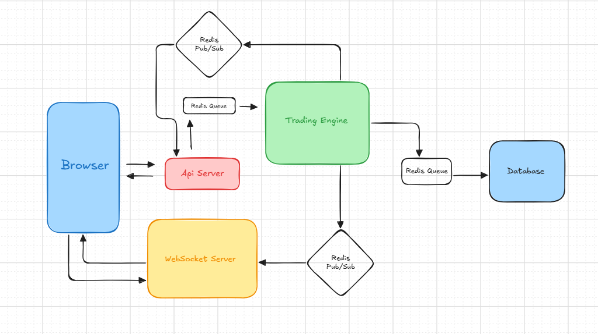

# Web2 Exchange

A trading system to exchange base and qoute assets, optimized for ultra-low latency order handling and live market interaction. The platform combines modern frontend technology, a Bun-powered backend, and a modular service design to deliver both speed and scalability.

## Highlights

- Millisecond-level execution and order confirmation (7–20ms typical)
- Live updates delivered via WebSockets
- Strong API validation and secure routing
- Loosely coupled services with Redis for communication
- Interactive, responsive interface with smart code splitting
- Real-time charts: depth, ticker, candlesticks (K-line)
- Dynamic market data subscription per client session
  
## Architecture

## ⚙️ Trade Engine 

Manages Trades and handle orderbook logic for trades:

- Built around single-responsibility services in a class-based style.
- Core domain services: Orders, OrderBook, Balances, Snapshots.
- Auxiliary services: Market data formatting, error reporting, Redis integration.
- Outbound communication always flows through a unified Redis service.

## 📡 Real-Time Websocket Server

The WebSocket layer provides a live connection between traders and the market:

- **Connection Pool:** Tracks all active client connections.
- **Session Sockets:** Maintain subscriptions and client state.
- **Channel Broker:** Bridges Redis Pub/Sub to connected clients.

**Workflow:**

- New connections are added to the Connection Pool.
- Client Connections register subscriptions via the Broker.
- The Broker listens for Redis Pub/Sub messages and dispatches updates to clients.

## 🖥️ User Interface

The UI is powered by Next.js and designed for speed + real-time interactivity:

- Server-side preloading for ticker/depth data.
- WebSocket manager handles live streams and subscriptions.
- Trading View charts to show kline data.
- Singleton Pattern for Handling Socket Logic.
  
## Tech Stack

- **Frontend:** Next.js (App Router, Server Actions)
- **API Server:** Nodejs + Express with Zod validation
- **WebSocket Server:** ws library to handle realtime connections
- **Trading Engine:** In-memory orderbook & balances (modular, class-based)
- **Inter-service Communication:** Redis Queue & Pub/Sub

### Key Features

- Place/cancel orders with real-time feedback
- Live market orderbook, ticker, and trade history
- User’s open orders and asset balances
- Kline (candlestick) and ticker visualizations
- Onramping initial assets for users
- Optimized bundle size and performance

---
